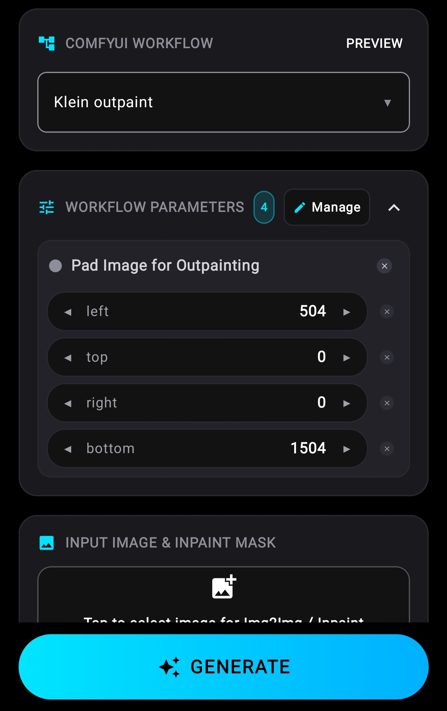
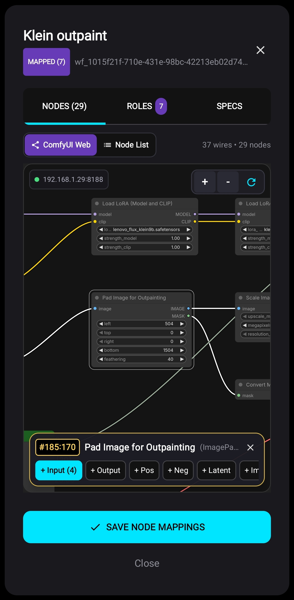
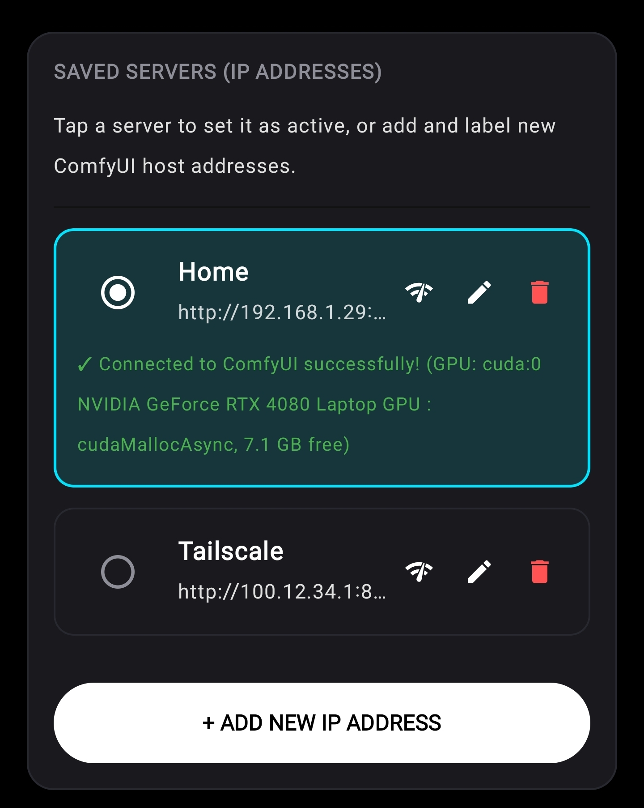
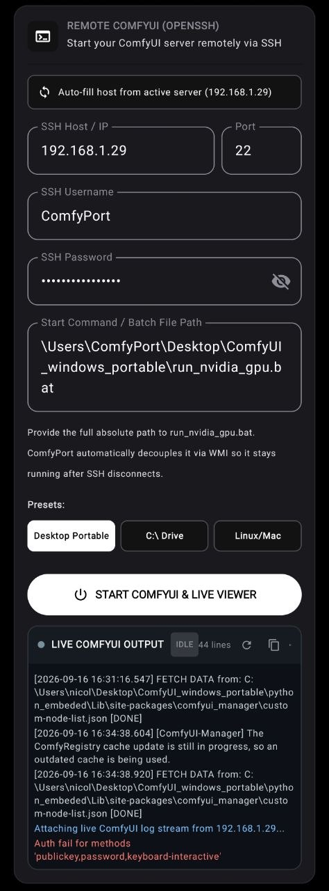
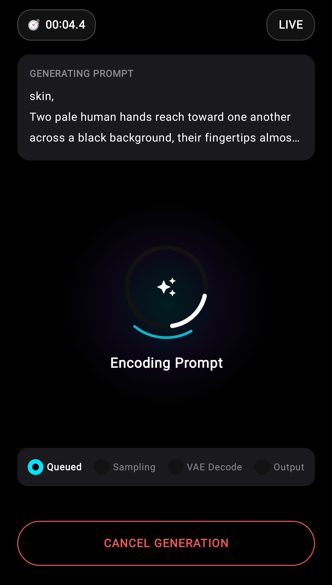
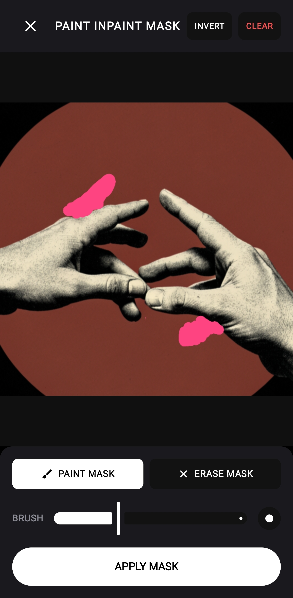

# ComfyPort

[](https://developer.android.com)
[](https://kotlinlang.org)
[](https://developer.android.com/jetpack/compose)
[](LICENSE)
[](https://ko-fi.com/comfyport)

ComfyPort is a fully native, high-performance Android client designed to interface directly with self-hosted ComfyUI servers, remote GPU rigs, and cloud instances.

ComfyUI is an exceptional platform for generative AI on desktop environments. However, interacting with dense node graphs through mobile web browsers presents serious usability challenges: manipulating complex connection topologies on touch displays frequently causes accidental node mutations, missed connections, and awkward parameter adjustment.

ComfyPort solves this problem with a touch-first native interface that connects directly to your existing ComfyUI server. Run, monitor, and adjust your workflows on your phone or tablet with zero custom server plugins.

---

## Workflow Interface & Architecture

ComfyPort is designed to handle arbitrary real-world graphs rather than restricting users to rigid templates:

### 1. One-Tap Desktop Run Importer
Directly queries your server's `/history` endpoint:
* Tap **Import Last Run** in the Workflow Manager.
* Instantly loads the exact workflow (Flux, SDXL, Inpainting, ControlNet, or custom pipelines) recently executed on your desktop directly into your mobile session.

### 2. Modular Node Mapping
Take control over which parts of your graph appear on your mobile dashboard:
* **Automatic Detection**: Positive and negative text prompts, latent dimensions, seed, step count, and sampler configurations are automatically detected and surfaced as clean mobile input fields.
* **Custom Parameter Mapping**: Tap any node in your graph to expose its specific widgets. Adjust CFG scales, LoRA weights, denoise levels, checkpoint models, or custom node sliders without navigating visual node spaghetti.

### 3. Interactive 2D Graph Canvas
Verify your execution logic before queuing generations:
* Open the **2D Graph Inspector** for a comprehensive visual canvas.
* Pan, pinch-to-zoom, and inspect every node, connection wire (Latent, VAE, CLIP, Image, Model), and parameter directly on your phone or tablet.

---

## Interface Showcase

| Modular Node Mapping | Interactive 2D Graph | Multi-Server Manager |
| :---: | :---: | :---: |
|  |  |  |
| Custom widget parameters surfaced directly on your mobile dashboard. | Full pan-and-zoom node topology to inspect connections on the go. | Manage local Wi-Fi, Tailscale VPN, and Cloud GPU endpoints. |

| Remote OpenSSH Booter | Live Progress & Previews | Touch Inpainting Studio |
| :---: | :---: | :---: |
|  |  |  |
| Boot your PC and launch ComfyUI remotely with an interactive console. | Real-time generation progress, stopwatch, and active step tracking. | Dedicated drawing canvas with adjustable brushes for alpha mask generation. |

---

## Key Features

### Multi-Host & Remote Infrastructure
* **Direct Server Connectivity**: Connects to any ComfyUI instance over local Wi-Fi, private mesh VPNs (such as Tailscale or WireGuard), or cloud reverse proxies (RunPod, Vast.ai).
* **Saved Server Profiles**: Label and store multiple endpoints (e.g., Home Workstation, Tailscale Remote, Cloud GPU) and switch active servers with a single tap.
* **Remote OpenSSH Rig Booter**: Boot your PC and start ComfyUI remotely over SSH (via JSch), complete with a live terminal console for streaming console output and startup logs.

### Client-Side Workflow Engine
* **Zero Server Plugins Required**: Includes an embedded client-side converter that executes ComfyUI's standard `graphToPrompt()` algorithm, transforming raw LiteGraph UI workflows (`workflow.json`) into fully compliant API execution payloads on-device.
* **Automatic Topology Auto-Mapping**: Intelligently identifies positive/negative prompts, latent dimensions, samplers, checkpoints, LoRAs, and output nodes in imported graphs.
* **Server History Importer**: Queries your ComfyUI server's `/history` endpoint to inspect recent desktop runs and import their workflows directly to your mobile library.

### Mobile Generation & Creative Studio
* **Touch Inpainting Mask Studio**: Dedicated inpainting canvas featuring adjustable brush sizes, transparency controls, and instant PNG alpha mask encoding.
* **Aspect Ratio & Resolution Presets**: Fast selectors for standard ratios (1:1, 4:3, 3:4, 16:9, 9:16, 21:9) with dynamic megapixel calculation and dimension scaling.
* **Real-Time Progress & Intermediate Previews**: Real-time progress indicators, step counters (e.g., Step 14/25), generation stopwatches, and intermediate step preview images streamed via persistent WebSockets.
* **Floating Queue Management**: Global floating badge displaying active queue counts, with bottom-sheet controls to clear pending batches or immediately abort active runs.

### Media Management & Portability
* **High-Performance Gallery**: Fast asynchronous image grid with disk caching powered by Coil.
* **Full-Resolution Viewer**: Pinch-to-zoom inspection with double-tap zoom reset.
* **Prompt & Seed Reloading**: Re-populate your prompt parameters and generation settings from any previously generated gallery item with a single tap.
* **Native Sharing & Export**: Export uncompressed images directly to the device's Downloads folder or share through the native Android Sharesheet.
* **Encrypted Full Backup & Restore**: Export and restore your complete library of workflows and server profiles via JSON.

### Privacy, Security & Design
* **OLED Dark Aesthetic**: Interface designed specifically for OLED displays, with customizable accent highlight colors (Emerald, Electric Cyan, Neon Purple, Sunset Orange, Hot Pink, or custom HEX).
* **Hardware-Backed Cryptography**: All SSH passwords and server credentials are cryptographically protected using Android's `EncryptedSharedPreferences` (AES-256 GCM).
* **Direct & Telemetry-Free**: 100% direct client-to-server communication. No analytics SDKs, no tracking, and no intermediary relay servers.

---

## Getting Started

### 1. Server Configuration
Start your ComfyUI instance with the `--listen` argument to allow network connections:
```bash
python main.py --listen
```
*(If using the standalone portable Windows build, you can append `--listen` to your `run_nvidia_gpu.bat` script.)*

### 2. Connecting the App
1. Open ComfyPort and navigate to **Settings** -> **Saved Servers**.
2. Tap **Add Server** and enter your server address:
   * **Local Network**: `http://192.168.1.xxx:8188`
   * **Tailscale (Recommended)**: `http://100.x.y.z:8188`
   * **Cloud GPU Proxy**: `https://<your-pod-id>-8188.proxy.runpod.net`
3. Tap **Test Connection** to verify reachability.

### 3. Downloading the App
Download the latest pre-compiled APK from the [Releases](https://github.com/NicolasCampailla/ComfyPort/releases) page and install it on your Android device (Android 8.0+).

### 4. Building from Source
```bash
# Clone the repository
git clone https://github.com/NicolasCampailla/ComfyPort.git
cd ComfyPort

# Build the debug APK
./gradlew assembleDebug

# Install to a connected device or emulator
./gradlew installDebug
```

---

## Technology Stack

* **UI Framework**: Jetpack Compose & Material 3 (OLED Dark Mode)
* **Architecture**: Modern Android Architecture with Kotlin Coroutines & Flow
* **Networking**: OkHttp 4 with persistent Duplex WebSockets
* **Remote Management**: JSch OpenSSH client with interactive PTY terminal streaming
* **Image Loading**: Coil 2.7 with disk and memory caching
* **Security**: Android Jetpack Security (`EncryptedSharedPreferences` with AES-256 GCM)

---

## Project Background

This project began from a practical desire: to generate images on a mobile device without having to constantly transfer files back and forth with a desktop computer, using an interface that feels fast, natural, and comfortable on a touch screen. Over time, it evolved into a full-featured client capable of handling complex production workflows, which is why I decided to open-source it for the community.

In the spirit of full transparency, ComfyPort was built in pair-programming collaboration with Antigravity, an agentic AI coding assistant developed by Google DeepMind. Together, we designed the architecture from scratch, implemented client-side LiteGraph execution, and optimized the app for modern Android hardware.

---

## Support

If ComfyPort improves your workflow or makes managing your generative AI pipelines more accessible, consider supporting ongoing development:

[](https://ko-fi.com/comfyport)

All donations directly support me as an independent developer working my way through college.

---

## License

This project is licensed under the [MIT License](LICENSE).